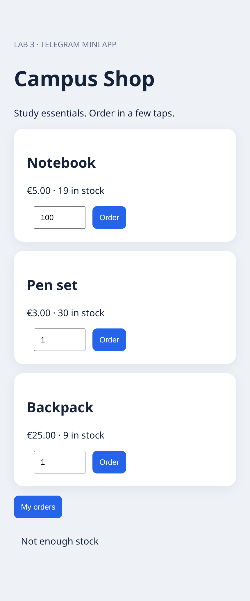

# Robotic Process Automation
# Laboratory Work No. 3
## Developing a Telegram Bot Integrated with a Back-End Application

Student: Matvei Krautsou

Project: Campus Shop — Telegram e-commerce bot and Mini App

Date: 6 October 2026

## 1. Objective

Develop a Python Telegram bot integrated with a separate back-end application. Demonstrate inline keyboards, stickers, and a Mini App. Implement the advanced task by placing the main business logic and persistent data in the back end.

## 2. Business area and business process

The selected area is e-commerce: a campus shop selling stationery and study accessories. Its customer process is: open the bot, browse the catalog, select a product, confirm the purchase, receive an order number and total, and view personal order history. A customer can also use the Mini App to choose quantities and create orders.

The server checks product existence and inventory, obtains the authoritative price, calculates the total, reduces the remaining stock, and saves the order. Cancellation makes no database changes. Insufficient stock produces an error and creates no order. This prototype records purchases; it does not charge money or arrange delivery.

## 3. Technologies and architecture

Python 3.12 implements the Telegram bot with standard-library HTTP requests and long polling. Node.js 24 implements the HTTP back end. Its built-in SQLite driver stores products and orders. HTML, CSS, and JavaScript implement the Mini App. The Telegram WebApp SDK supplies initialization data and success haptic feedback.

Bot interaction: Telegram user -> Telegram Bot API -> Python bot -> Node.js REST API -> SQLite.

Mini App interaction: Telegram user -> HTML/JavaScript Mini App -> Node.js REST API -> SQLite.

The bot handles conversation and presentation. The back end owns stock validation, price calculation, order creation, and history. Both interfaces call the same business API. Runtime application code requires no npm or pip packages. Report generation uses ReportLab, python-docx, and Pillow; these are separate from application runtime dependencies.

## 4. Bot registration and Telegram interaction

The project bot is @Lab3MKbot; its visible chat name in the supplied screenshots is Lab3_MK. The token was obtained through BotFather and loaded into the local runtime configuration. Telegram getMe successfully verified the token and bot username. The token is excluded from the source repository and report.

The /start command sends a welcome message and an inline keyboard containing Catalog and My orders. It then uploads an original static WEBP shopping-bag sticker. The Catalog button returns product buttons containing the name, price, remaining stock, and product ID in callback data. Choosing a product opens Confirm order / Cancel. Confirm order posts an order to the back end; Cancel returns to the catalog.

The bot removes the confirmation keyboard after a successful purchase. Each confirmed bot purchase orders one item. The Mini App supports quantities from 1 to 100. Repeated or retried purchase requests are not protected by an idempotency key and can create separate orders; this remains a prototype limitation.

Open Mini App is displayed in private chats only when WEB_APP_URL contains a configured HTTPS address. In the supplied Telegram screenshots this button is absent; therefore those screenshots demonstrate the bot workflow, not Mini App deployment within Telegram.

## 5. Mini App implementation

The Mini App is served by the same backend at /. Its responsive catalog shows product cards, euro prices, inventory counts, quantity inputs, and Order buttons. My orders displays order numbers, quantities, and totals. A successful purchase updates the catalog and displays a confirmation. Backend errors are shown in the status area.

When opened inside Telegram, the page reads Telegram.WebApp.initData and sends it in X-Telegram-Init-Data. The server authenticates it before allowing purchases or accessing history. For isolated local browser demonstrations, DEMO_MODE uses a fixed test identity. This mode must not be used on a public deployment.

The four screenshots in Section 10 were captured from the actual page using Chromium at a mobile viewport of 430 x 932 pixels. They use a separate in-memory demo database and do not alter the live bot's database. They are genuine local-browser screenshots, not generated illustrations and not screenshots of a deployed Telegram WebView.

## 6. Back-end API

GET /health returns service readiness. GET /api/products returns the catalog. POST /api/orders accepts product_id and quantity and returns the stored order. GET /api/orders returns only the authenticated user's orders. GET / serves the Mini App.

The server rejects invalid JSON, oversized request bodies, invalid quantities, missing products, unauthenticated requests, and insufficient stock. Relevant response statuses are 200 for retrieval, 201 for creation, 400 for invalid input, 401 for missing authentication, 404 for missing resources, 409 for insufficient stock, and 413 for excessive request size.

A client-supplied price is never used. Prices are stored as integer euro cents, which avoids floating-point rounding during total calculation. The seeded catalog contains Notebook (500 cents), Pen set (300 cents), and Backpack (2500 cents).

## 7. Database and transaction

The products table contains id, name, price, and stock. The orders table contains id, user_id, product_id, quantity, total, and created_at. A foreign key links each order to its product. Database files are stored in backend/data/ and ignored by Git.

Order creation uses BEGIN IMMEDIATE, reads the product, validates stock, subtracts the quantity, inserts the order, and commits. Any failure rolls the transaction back. The stock column also has a non-negative CHECK constraint. The initial products are inserted with INSERT OR IGNORE, so restarting the application does not overwrite inventory.

## 8. Authentication and configuration

Python-to-backend requests carry a shared BACKEND_API_KEY in X-Api-Key and specify the Telegram user ID. The Mini App instead supplies signed Telegram initialization data. The back end derives a secret using HMAC-SHA256 with WebAppData and the bot token, verifies Telegram's data-check-string signature with a constant-time comparison, checks a maximum age of one hour, and uses the identity from the signed user object.

A user ID supplied in an unsigned Mini App request cannot replace the signed identity. Order-history queries filter by that authenticated identity. Tokens and API keys are loaded from environment variables; .env is ignored. HTTPS is required for the public Mini App endpoint.

## 9. Validation and observed Telegram results

The Node.js integration test passed. Its assertions cover health and HTML responses, three catalog products, unauthorized order rejection, a two-notebook order totalling 1000 cents, invalid quantities, missing products, insufficient stock, unchanged stock after rejection, user-isolated history, a valid Telegram signature, and rejection of tampered initialization data.

Two Python mock tests passed. They verify the /start welcome flow, sticker invocation and Mini App keyboard, and that a purchase callback sends the correct backend request and presents the returned confirmation. They exercise Python logic without contacting Telegram.

The real backend health check and authenticated history request returned HTTP 200. Telegram getMe verified @Lab3MKbot, and getWebhookInfo confirmed that the polling bot has no configured webhook.

The student supplied three Telegram screenshots. The first shows /start, the welcome message, Catalog / My orders, and the shopping-bag sticker. The second shows the catalog, purchase confirmation, Order #2 confirmed! Total: EUR 5.00, and its history entry. The third shows a backpack order (#3, EUR 25.00), history entries for orders #3 and #2, and updated inventory: Notebook 18, Pen set 30, Backpack 9. Together, these images demonstrate end-to-end bot purchases, personal history, and inventory updates.

The inline Telegram screenshots were visible in the chat but were not exposed as downloadable source files in the build workspace. Their observed contents are documented here; their original images are not embedded in this version. The four Mini App screenshots below are embedded. No Telegram screenshot was fabricated or reconstructed.

## 10. Mini App screenshots

### Figure 1. Product catalog

Actual local browser capture: Notebook EUR 5.00, Pen set EUR 3.00, Backpack EUR 25.00; quantity fields and purchase buttons.

### Figure 2. Successful purchase

A notebook purchase returns Order #1 and EUR 5.00. Remaining notebook stock changes from 20 to 19.

### Figure 3. Personal order history

After purchasing a notebook and a backpack, history displays orders #1 and #2 with their respective totals. Order numbers differ from the live Telegram screenshots because this test uses an isolated database.

### Figure 4. Insufficient stock

Attempting to order 100 notebooks exceeds available stock. The server returns Not enough stock and does not create a new order.

## 11. Reproducing the application

Requirements: Node.js 24+ and Python 3.12+. Copy .env.example to a local .env and configure TELEGRAM_BOT_TOKEN, BACKEND_API_KEY, BACKEND_URL, and, for the Telegram Mini App, WEB_APP_URL. Both processes must receive the same token and API key. The included welcome.webp is the original sticker and needs no generation or image library at runtime.

Start the backend from backend/ with node server.js. Start the bot from the project root with python bot/main.py. Run a single polling worker per bot token. The bot removes an existing webhook on startup. The backend must be reachable at BACKEND_URL.

For local browser testing, start the backend with DEMO_MODE=1 and open its HTTP root locally. Never enable that setting publicly. Detailed commands and environment handling are provided in README.md. Run npm test in backend/ and python -m unittest -v in bot/ to reproduce automated checks.

## 12. Hosting and limitations

The real backend and bot were started in the current cloud development environment. This does not guarantee 24/7 uptime: stopping or recycling the environment can stop the processes. A permanent deployment must preserve SQLite data and supervise both processes. A public HTTPS endpoint and WEB_APP_URL are still needed to open the Mini App from Telegram; local browser functionality has been verified.

No payment processing, delivery workflow, inventory administration, or production rate limiting is included. API keys, HTTPS termination, backups, and access policies require appropriate configuration for a real deployment. Repeated purchase requests lack idempotency. These limitations do not affect the demonstrated laboratory order and inventory flow.

## 13. Conclusion

The project implements a Python Telegram shopping bot and a separate Node.js backend with SQLite business logic. It uses inline keyboards, an original sticker, and a responsive Mini App. Automated API and Python tests passed. The supplied Telegram evidence demonstrates live bot purchases, history, and stock changes; real browser screenshots demonstrate the Mini App workflow and validation. The remaining deployment step is permanent hosting with a public HTTPS Mini App URL.

## Appendix A. Complete project source

The following source files are reproduced in the generated PDF, DOCX, and HTML report. The GitHub repository additionally contains the original sticker, screenshot images, tests, README, and editable report source.
