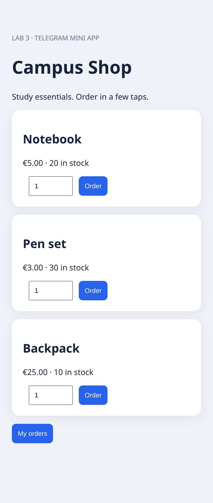
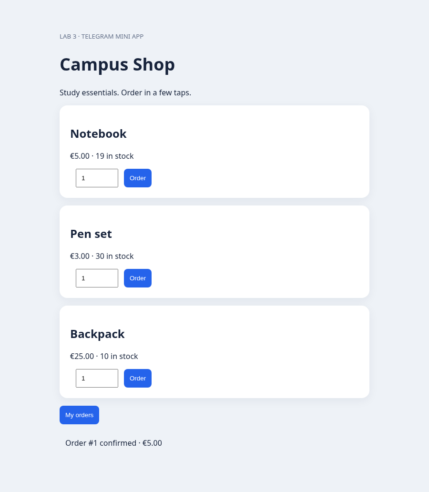
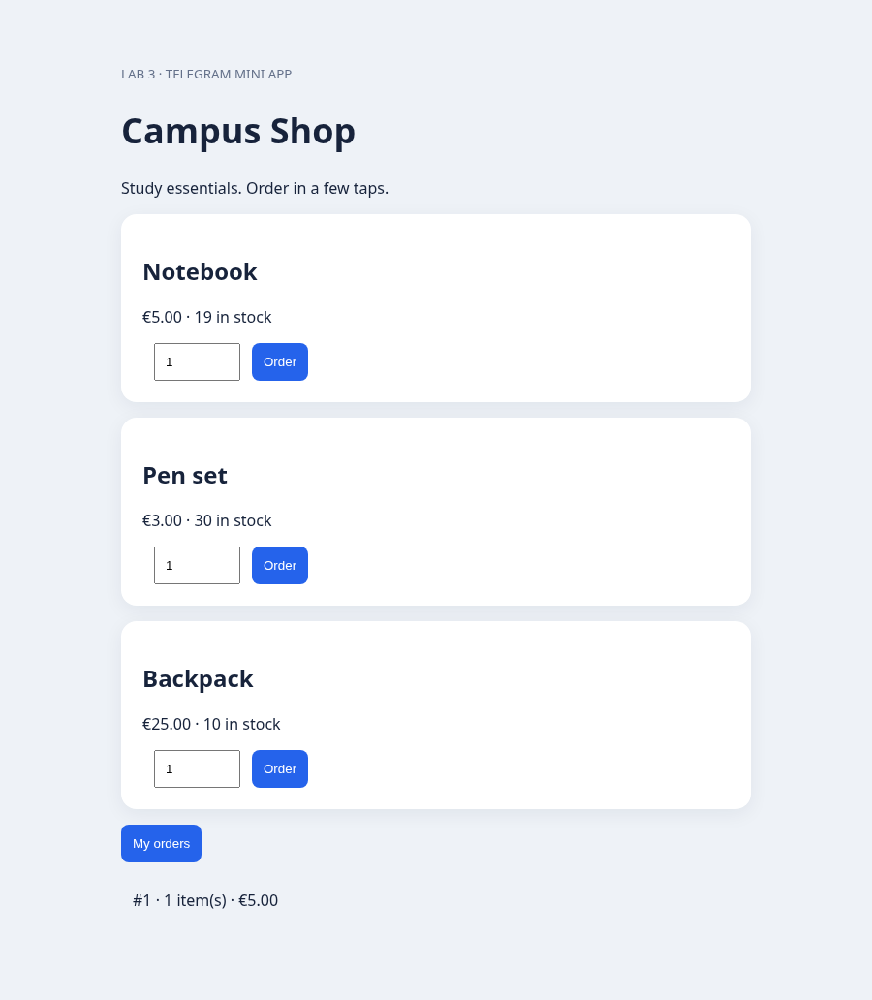

# Robotic Process Automation — Lab 3
## Developing a Telegram Bot Integrated with a Back-End Application

Student: ____________________  Group: ____________________

## 1. Business area and process

Business area: e-commerce for a campus stationery shop. The customer browses available products, selects an item, confirms the purchase, receives its order number and total, and views personal order history. The server checks inventory, calculates the price, reduces stock, and stores the order. A cancelled confirmation makes no changes. An unavailable item produces an error without creating an order.

## 2. Architecture

Telegram user → Python bot → Node.js REST API → SQLite.

Telegram user → Mini App (HTML/JavaScript) → the same REST API → SQLite.

The Python bot controls conversation and Telegram features. Business rules and persistence are owned by the back end. Both clients reuse the same order logic. No payment collection is implemented.

## 3. Telegram features

`/start` displays an inline keyboard with Catalog, My orders, and, when configured in a private chat, Open Mini App. It uploads the project's original shopping-bag WEBP sticker. Catalog buttons carry product identifiers in callback data. Selecting a product displays Confirm order and Cancel. Confirmation sends an authenticated HTTP request and reports the resulting order number and total.

The Mini App offers product cards, quantity inputs, order buttons, and personal order history. It uses Telegram WebApp initialization data and success haptic feedback. Its URL must be HTTPS.

## 4. Back end and persistence

Node.js 24 provides the HTTP server and built-in SQLite driver. Products store integer prices in euro cents and stock quantities. Orders store the Telegram user ID, product, quantity, total, and timestamp. The server seeds three products only if missing.

Endpoints: GET /health, GET /api/products, POST /api/orders, GET /api/orders, and GET / for the Mini App.

The server validates integer quantities from 1 to 100 and product existence. A SQLite transaction reads inventory, checks availability, reduces stock, and inserts the order atomically. If stock is insufficient, the transaction is rolled back and HTTP 409 returned. Prices come from the database rather than from the client.

## 5. Authentication and configuration

The bot sends a shared server-side API key. The Mini App sends Telegram initData. The backend validates its HMAC-SHA256 signature using the bot token, checks that its timestamp is no older than one hour, and derives the customer identity from the signed user payload. An unsigned user ID supplied by the Mini App cannot override this identity. Order history is filtered by the authenticated identity.

Tokens and keys belong in environment variables and are not committed. A local-only demo mode uses a test identity for browser validation. It must never be used for a public deployment.

## 6. Bot registration and startup

The student must register the bot through the official @BotFather using /newbot. The repository includes .env.example and detailed startup instructions in README.md. Use a real token, matching backend API key, and public HTTPS Mini App URL. Start the Node.js backend first, then the Python long-polling bot. Verify all interactions in a private Telegram chat.

The provided bot token was verified successfully with Telegram getMe: the bot is @Lab3MKbot. The backend and Python long-polling process were started in the cloud environment. The backend health check and authenticated order-history request returned HTTP 200. Telegram confirmed that no webhook remains configured. End-to-end interaction in the Telegram client has not yet been independently verified. A public HTTPS Mini App deployment is still required. The screenshots below show the actual local Mini App; Telegram-chat screenshots must be added separately.

## 7. Validation results

The Node.js HTTP integration suite passed. It covers catalog retrieval, creation and calculation of an order, rejected unauthenticated requests, invalid quantities, missing products, insufficient stock, stock consistency, isolated order histories, Telegram signature verification, and tampered initData.

Two Python mock tests passed: /start sends the sticker and Mini App keyboard; an order callback sends the correct backend request and returns the confirmation text. These validate bot logic without contacting Telegram.

An actual Chromium browser smoke check exercised the running local Mini App: loaded the catalog, ordered a notebook for EUR 5.00, and displayed history. The screenshots show this local demo, not a live Telegram session.

### Catalog

### Confirmed order

### Order history

## 8. Conclusion and remaining steps

The project implements the basic and advanced code requirements: Python Telegram bot, inline keyboards, sticker, Mini App, and a separate back end handling inventory and orders. Local business logic and browser behavior were validated. To complete submission evidence, deploy a persistent host and HTTPS Mini App URL, run the live Telegram checklist, fill in student details, and append real Telegram screenshots of /start, catalog, confirmed purchase, and personal history.

Prototype limitations include no payment or delivery integration and no request idempotency. Repeated confirmation requests can create separate purchases. A production version should add idempotency, rate limits, deployment hardening, and inventory administration.

## 9. Hosting status

The backend and bot are running in the current cloud task environment. This is a temporary development runtime, not a guaranteed 24/7 deployment. Stopping or recycling this environment can stop both processes. Persistent hosting must keep the Node.js backend and Python polling worker running and preserve the SQLite database. Only one polling worker should run per bot token. A public HTTPS endpoint is required for the Mini App.
